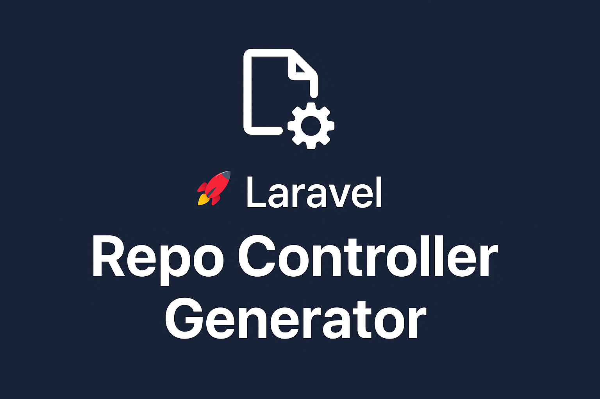

# 🚀 Laravel Repo Controller Generator

**A lightweight Laravel package to generate full-featured CRUD controllers, repositories, form requests, resources, and collections — all in one shot.**

---

## 👋 Introduction

Hi, I'm **Sobhan Aali** — thanks for checking out this package!
# 🚀 Laravel Repo Controller Generator

**A lightweight Laravel package to generate full-featured CRUD controllers, repositories, form requests, and resources — all in one shot.**

---

## 👋 Introduction

Hi, I'm **Sobhan Aali** — thanks for checking out this package!

`laravel-repo-controller-generator` is designed to **speed up your Laravel development workflow** by generating a full CRUD setup with just one Artisan command. It promotes clean architecture by separating concerns using repositories, request validation, and resource transformation.

---

## 📦 Features

- ✅ Generate **CRUD Controllers**
    
- ✅ Automatically create **Repositories**
    
- ✅ Generate **Form Requests** for `store` and `update`
    
- ✅ Create **API Resources** (both admin and public versions)
    
- ✅ Clean file structure based on namespace conventions
    

---

## ⚙️ Installation

Install the package via Composer:

```bash
composer require sobhan-aali/laravel-repo-controller-generator:dev-master
```

---

## 🧱 Before You Start

### 1. Publish Stub Files

The package uses stub templates to generate your classes. Run this command to publish them for customization:

```bash
php artisan vendor:publish --tag=repo-controller-stubs
```

### 2. Use the `GetFillables` Trait

Make sure your base model uses the `GetFillables` trait for automatic field generation:

```php
use SobhanAali\LaravelRepoControllerGenerator\Traits\GetFillables;

class BaseModel extends Model
{
    use GetFillables;
}
```

> You can extend your Eloquent models from this base class for consistency.

---

## 🚀 Usage

Run the following command to generate a complete CRUD setup:

```bash
php artisan make:repo-controller Api/V1/Admin/CRUD/PostController
```

> ⚠️ **Note**: The names# 🚀 Laravel Repo Controller Generator

**A lightweight Laravel package to generate full-featured CRUD controllers, repositories, form requests, and resources — all in one shot.**

---

## 👋 Introduction

Hi, I'm **Sobhan Aali** — thanks for checking out this package!

`laravel-repo-controller-generator` is designed to **speed up your Laravel development workflow** by generating a full CRUD setup with just one Artisan command. It promotes clean architecture by separating concerns using repositories, request validation, and resource transformation.

---

## 📦 Features

- ✅ Generate **CRUD Controllers**
    
- ✅ Automatically create **Repositories**
    
- ✅ Generate **Form Requests** for `store` and `update`
    
- ✅ Create **API Resources** (both admin and public versions)
    
- ✅ Clean file structure based on namespace conventions
    

---

## ⚙️ Installation

Install the package via Composer:

```bash
composer require sobhan-aali/laravel-repo-controller-generator:dev-master
```

---

## 🧱 Before You Start

### 1. Publish Stub Files

The package uses stub templates to generate your classes. Run this command to publish them for customization:

```bash
php artisan vendor:publish --tag=repo-controller-stubs
```

### 2. Use the `GetFillables` Trait

Make sure your base model uses the `GetFillables` trait for automatic field generation:

```php
use SobhanAali\LaravelRepoControllerGenerator\Traits\GetFillables;

class BaseModel extends Model
{
    use GetFillables;
}
```

> You can extend your Eloquent models from this base class for consistency.

---

## 🚀 Usage

Run the following command to generate a complete CRUD setup:

```bash
php artisan make:repo-controller Api/V1/Admin/CRUD/PostController
```

> ⚠️ **Note**: The names# 🚀 Laravel Repo Controller Generator

**A lightweight Laravel package to generate full-featured CRUD controllers, repositories, form requests, and resources — all in one shot.**

---

## 👋 Introduction

Hi, I'm **Sobhan Aali** — thanks for checking out this package!

`laravel-repo-controller-generator` is designed to **speed up your Laravel development workflow** by generating a full CRUD setup with just one Artisan command. It promotes clean architecture by separating concerns using repositories, request validation, and resource transformation.

---

## 📦 Features

- ✅ Generate **CRUD Controllers**
    
- ✅ Automatically create **Repositories**
    
- ✅ Generate **Form Requests** for `store` and `update`
    
- ✅ Create **API Resources** (both admin and public versions)
    
- ✅ Clean file structure based on namespace conventions
    

---

## ⚙️ Installation

Install the package via Composer:

```bash
composer require sobhan-aali/laravel-repo-controller-generator:dev-master
```

---

## 🧱 Before You Start

### 1. Publish Stub Files

The package uses stub templates to generate your classes. Run this command to publish them for customization:

```bash
php artisan vendor:publish --tag=repo-controller-stubs
```

### 2. Use the `GetFillables` Trait

Make sure your base model uses the `GetFillables` trait for automatic field generation:

```php
use SobhanAali\LaravelRepoControllerGenerator\Traits\GetFillables;

class BaseModel extends Model
{
    use GetFillables;
}
```

> You can extend your Eloquent models from this base class for consistency.

---

## 🚀 Usage

Run the following command to generate a complete CRUD setup:

```bash
php artisan make:repo-controller Api/V1/Admin/CRUD/PostController
```# 🚀 Laravel Repo Controller Generator

**A lightweight Laravel package to generate full-featured CRUD controllers, repositories, form requests, and resources — all in one shot.**

---

## 👋 Introduction

Hi, I'm **Sobhan Aali** — thanks for checking out this package!

`laravel-repo-controller-generator` is designed to **speed up your Laravel development workflow** by generating a full CRUD setup with just one Artisan command. It promotes clean architecture by separating concerns using repositories, request validation, and resource transformation.

---

## 📦 Features

- ✅ Generate **CRUD Controllers**
    
- ✅ Automatically create **Repositories**
    
- ✅ Generate **Form Requests** for `store` and `update`
    
- ✅ Create **API Resources** (both admin and public versions)
    
- ✅ Clean file structure based on namespace conventions
    

---

## ⚙️ Installation

Install the package via Composer:

```bash
composer require sobhan-aali/laravel-repo-controller-generator:dev-master
```

---

## 🧱 Before You Start

### 1. Publish Stub Files

The package uses stub templates to generate your classes. Run this command to publish them for customization:

```bash
php artisan vendor:publish --tag=repo-controller-stubs
```

### 2. Use the `GetFillables` Trait

Make sure your base model uses the `GetFillables` trait for automatic field generation:

```php
use SobhanAali\LaravelRepoControllerGenerator\Traits\GetFillables;

class BaseModel extends Model
{
    use GetFillables;
}
```

> You can extend your Eloquent models from this base class for consistency.

---

## 🚀 Usage

Run the following command to generate a complete CRUD setup:

```bash
php artisan make:repo-controller Api/V1/Admin/CRUD/PostController
```

> ⚠️ **Note**: The namespace must begin with `Api/V` followed by your desired version (e.g., `V1`).

---

## 🗂️ What Gets Generated?

Running the command above will generate the following files for the `Post` model:

### 🧾 Form Requests

- `app/Http/Requests/Admin/CRUD/Post/StorePostRequest.php`
    
- `app/Http/Requests/Admin/CRUD/Post/UpdatePostRequest.php`
    

### 🎯 Resources

- `app/Http/Resources/Post/PostResource.php`
    
- `app/Http/Resources/Post/AdminPostResource.php`
    

### 🧠 Repository

- `app/Repositories/Eloquent/PostRepository.php`
    

### 🎮 Controller

- `app/Http/Controllers/Api/V1/Admin/CRUD/PostController.php`
    

All files are tightly connected and follow Laravel's best practices. With minimal adjustments, you can plug them directly into your application and get started fast.


> ⚠️ **Note**: The namespace must begin with `Api/V` followed by your desired version (e.g., `V1`).

---

## 🗂️ What Gets Generated?

Running the command above will generate the following files for the `Post` model:

### 🧾 Form Requests

- `app/Http/Requests/Admin/CRUD/Post/StorePostRequest.php`
    
- `app/Http/Requests/Admin/CRUD/Post/UpdatePostRequest.php`
    

### 🎯 Resources
# 🚀 Laravel Repo Controller Generator

**A lightweight Laravel package to generate full-featured CRUD controllers, repositories, form requests, and resources — all in one shot.**

---

## 👋 Introduction

Hi, I'm **Sobhan Aali** — thanks for checking out this package!

`laravel-repo-controller-generator` is designed to **speed up your Laravel development workflow** by generating a full CRUD setup with just one Artisan command. It promotes clean architecture by separating concerns using repositories, request validation, and resource transformation.

---

## 📦 Features

- ✅ Generate **CRUD Controllers**
    
- ✅ Automatically create **Repositories**
    
- ✅ Generate **Form Requests** for `store` and `update`
    
- ✅ Create **API Resources** (both admin and public versions)
    
- ✅ Clean file structure based on namespace conventions
    

---

## ⚙️ Installation

Install the package via Composer:

```bash
composer require sobhan-aali/laravel-repo-controller-generator:dev-master
```

---

## 🧱 Before You Start

### 1. Publish Stub Files

The package uses stub templates to generate your classes. Run this command to publish them for customization:

```bash
php artisan vendor:publish --tag=repo-controller-stubs
```

### 2. Use the `GetFillables` Trait

Make sure your base model uses the `GetFillables` trait for automatic field generation:

```php
use SobhanAali\LaravelRepoControllerGenerator\Traits\GetFillables;

class BaseModel extends Model
{
    use GetFillables;
}
```

> You can extend your Eloquent models from this base class for consistency.

---

## 🚀 Usage

Run the following command to generate a complete CRUD setup:

```bash
php artisan make:repo-controller Api/V1/Admin/CRUD/PostController
```

> ⚠️ **Note**: The namespace must begin with `Api/V` followed by your desired version (e.g., `V1`).

---

## 🗂️ What Gets Generated?

Running the command above will generate the following files for the `Post` model:

### 🧾 Form Requests

- `app/Http/Requests/Admin/CRUD/Post/StorePostRequest.php`
    
- `app/Http/Requests/Admin/CRUD/Post/UpdatePostRequest.php`
    

### 🎯 Resources

- `app/Http/Resources/Post/PostResource.php`
    
- `app/Http/Resources/Post/AdminPostResource.php`
    

### 🧠 Repository

- `app/Repositories/Eloquent/PostRepository.php`
    

### 🎮 Controller

- `app/Http/Controllers/Api/V1/Admin/CRUD/PostController.php`
    

All files are tightly connected and follow Laravel's best practices. With minimal adjustments, you can plug them directly into your application and get started fast.

- `app/Http/Resources/Post/PostResource.php`
    
- `app/Http/Resources/Post/AdminPostResource.php`
    

### 🧠 Repository

- `app/Repositories/Eloquent/PostRepository.php`
    

### 🎮 Controller

- `app/Http/Controllers/Api/V1/Admin/CRUD/PostController.php`
    

All files are tightly connected and follow Laravel's best practices. With minimal adjustments, you can plug them directly into your application and get started fast.
pace must begin with `Api/V` followed by your desired version (e.g., `V1`).

---

## 🗂️ What Gets Generated?

Running the command above will generate the following files for the `Post` model:

### 🧾 Form Requests

- `app/Http/Requests/Admin/CRUD/Post/StorePostRequest.php`
    
- `app/Http/Requests/Admin/CRUD/Post/UpdatePostRequest.php`
    

### 🎯 Resources

- `app/Http/Resources/Post/PostResource.php`
    
- `app/Http/Resources/Post/AdminPostResource.php`
    

### 🧠 Repository

- `app/Repositories/Eloquent/PostRepository.php`
    

### 🎮 Controller

- `app/Http/Controllers/Api/V1/Admin/CRUD/PostController.php`
    

All files are tightly connected and follow Laravel's best practices. With minimal adjustments, you can plug them directly into your application and get started fast.
pace must begin with `Api/V` followed by your desired version (e.g., `V1`).

---

## 🗂️ What Gets Generated?

Running the command above will generate the following files for the `Post` model:

### 🧾 Form Requests

- `app/Http/Requests/Admin/CRUD/Post/StorePostRequest.php`
    
- `app/Http/Requests/Admin/CRUD/Post/UpdatePostRequest.php`
    

### 🎯 Resources

- `app/Http/Resources/Post/PostResource.php`
    
- `app/Http/Resources/Post/AdminPostResource.php`
    

### 🧠 Repository

- `app/Repositories/Eloquent/PostRepository.php`
    

### 🎮 Controller

- `app/Http/Controllers/Api/V1/Admin/CRUD/PostController.php`
    

All files are tightly connected and follow Laravel's best practices. With minimal adjustments, you can plug them directly into your application and get started fast.

`laravel-repo-controller-generator` is designed to **speed up your Laravel development workflow** by generating a full CRUD setup with just one Artisan command.  
It promotes clean architecture by separating concerns using repositories, request validation, resource transformation, and unified collection handling.

---

## 📦 Features

- ✅ Generate **CRUD Controllers**
    
- ✅ Automatically create **Repositories**
    
- ✅ Generate **Form Requests** for `store` and `update`
    
- ✅ Create **API Resources** (both admin and public versions)
    
- ✅ **Resource Traits** to share common fields between `Admin` and `Public` resources (DRY-friendly)
    
- ✅ **Collections** t# 🚀 Laravel Repo Controller Generator

**A lightweight Laravel package to generate full-featured CRUD controllers, repositories, form requests, and resources — all in one shot.**

---

## 👋 Introduction

Hi, I'm **Sobhan Aali** — thanks for checking out this package!

`laravel-repo-controller-generator` is designed to **speed up your Laravel development workflow** by generating a full CRUD setup with just one Artisan command. It promotes clean architecture by separating concerns using repositories, request validation, and resource transformation.

---

## 📦 Features

- ✅ Generate **CRUD Controllers**
    
- ✅ Automatically create **Repositories**
    
- ✅ Generate **Form Requests** for `store` and `update`
    
- ✅ Create **API Resources** (both admin and public versions)
    
- ✅ Clean file structure based on namespace conventions
    

---

## ⚙️ Installation

Install the package via Composer:

```bash
composer require sobhan-aali/laravel-repo-controller-generator:dev-master
```

---

## 🧱 Before You Start

### 1. Publish Stub Files

The package uses stub templates to generate your classes. Run this command to publish them for customization:

```bash
php artisan vendor:publish --tag=repo-controller-stubs
```

### 2. Use the `GetFillables` Trait

Make sure your base model uses the `GetFillables` trait for automatic field generation:

```php
use SobhanAali\LaravelRepoControllerGenerator\Traits\GetFillables;

class BaseModel extends Model
{
    use GetFillables;
}
```

> You can extend your Eloquent models from this base class for consistency.

---

## 🚀 Usage

Run the following command to generate a complete CRUD setup:

```bash
php artisan make:repo-controller Api/V1/Admin/CRUD/PostController
```

> ⚠️ **Note**: The namespace must begin with `Api/V` followed by your desired version (e.g., `V1`).

---

## 🗂️ What Gets Generated?

Running the command above will generate the following files for the `Post` model:

### 🧾 Form Requests

- `app/Http/Requests/Admin/CRUD/Post/StorePostRequest.php`
    
- `app/Http/Requests/Admin/CRUD/Post/UpdatePostRequest.php`
    

### 🎯 Resources

- `app/Http/Resources/Post/PostResource.php`
    
- `app/Http/Resources/Post/AdminPostResource.php`
    

### 🧠 Repository

- `app/Repositories/Eloquent/PostRepository.php`
    

### 🎮 Controller

- `app/Http/Controllers/Api/V1/Admin/CRUD/PostController.php`
    

All files are tightly connected and follow Laravel's best practices. With minimal adjustments, you can plug them directly into your application and get started fast.
o unify and standardize API responses for `index` and `paginate` endpoints
    
- ✅ Clean file structure based on namespace conventions
    

---

## ⚙️ Installation

Install the package via Composer:

```bash
composer require sobhan-aali/laravel-repo-controller-generator:dev-master
```

---

## 🧱 Before You Start

### 1. Publish Stub Files

The package uses stub templates to generate your classes. Run this command to publish them for customization:

```bash
php artisan vendor:publish --tag=repo-controller-stubs
```

### 2. Use the `GetFillables` Trait

Make sure your base model uses the `GetFillables` trait for automatic field generation:

```php
use SobhanAali\LaravelRepoControllerGenerator\Traits\GetFillables;

class BaseModel extends Model
{
    use GetFillables;
}
```

---

## 🚀 Usage

Run the following command to generate a complete CRUD setup:

```bash
php artisan make:repo-controller Api/V1/Admin/CRUD/PostController
```

> ⚠️ **Note**: The namespace must begin with `Api/V` followed by your desired version (e.g., `V1`).

---

## 🗂️ What Gets Generated?

Running the command above will generate the following files for the `Post` model:

### 🧾 Form Requests

- `app/Http/Requests/Admin/CRUD/Post/StorePostRequest.php`
    
- `app/Http/Requests/Admin/CRUD/Post/UpdatePostRequest.php`
    


می‌خوای بخش ApiResponse::success رو بذارم به صورت یک helper مستقل هم توضیح بدم (مثلاً success / error / validation) یا فقط توی Collection کفایت می‌کنه؟### 🎯 Resources & Traits

- `app/Http/Resources/Post/PostResource.php`
    
- `app/Http/Resources/Post/AdminPostResource.php`
    
- `app/Http/Resources/Post/PostResourceTrait.php` → shared fields between resources
    

### 📚 Collections

- `app/Http/Resources/Post/PostCollection.php`
    
    > Ensures consistent response format for lists and paginated results.
    

### 🧠 Repository

- `app/Repositories/Eloquent/PostRepository.php`
    

### 🎮 Controller

- `app/Http/Controllers/Api/V1/Admin/CRUD/PostController.php`
    

---

## 🔑 Key Benefits of New Features

### Resource Traits

- Common fields like `id`, `title`, `created_at` are stored in the **trait**.
    
- Both `Admin` and `Public` resources extend the trait and only merge their specific fields.
    
- Keeps your resources DRY and easy to maintain.
    

### Collections

- Standardizes API responses for `index` and `paginate`.
    
- Ensures all collections follow a consistent format across your project.
    
- Works seamlessly with Laravel's `ResourceCollection`.
    

#### 🔧 Usage Example

You can wrap your collections with the built-in response helper for **consistent API outputs**:

```php
use SobhanAali\LaravelRepoControllerGenerator\Support\ApiResponse;
use App\Http\Resources\Post\AdminPostResource;
use App\Http\Resources\Post\PostCollection;

public function index()# 🚀 Laravel Repo Controller Generator

**A lightweight Laravel package to generate full-featured CRUD controllers, repositories, form requests, and resources — all in one shot.**

---

## 👋 Introduction

Hi, I'm **Sobhan Aali** — thanks for checking out this package!

`laravel-repo-controller-generator` is designed to **speed up your Laravel development workflow** by generating a full CRUD setup with just one Artisan command. It promotes clean architecture by separating concerns using repositories, request validation, and resource transformation.

---

## 📦 Features

- ✅ Generate **CRUD Controllers**
    
- ✅ Automatically create **Repositories**
    
- ✅ Generate **Form Requests** for `store` and `update`
    
- ✅ Create **API Resources** (both admin and public versions)
    
- ✅ Clean file structure based on namespace conventions
    

---

## ⚙️ Installation

Install the package via Composer:

```bash
composer require sobhan-aali/laravel-repo-controller-generator:dev-master
```

---

## 🧱 Before You Start

### 1. Publish Stub Files

The package uses stub templates to generate your classes. Run this command to publish them for customization:

```bash
php artisan vendor:publish --tag=repo-controller-stubs
```

### 2. Use the `GetFillables` Trait

Make sure your base model uses the `GetFillables` trait for automatic field generation:

```php
use SobhanAali\LaravelRepoControllerGenerator\Traits\GetFillables;

class BaseModel extends Model
{
    use GetFillables;
}
```

> You can extend your Eloquent models from this base class for consistency.

---

## 🚀 Usage

Run the following command to generate a complete CRUD setup:

```bash
php artisan make:repo-controller Api/V1/Admin/CRUD/PostController
```

> ⚠️ **Note**: The namespace must begin with `Api/V` followed by your desired version (e.g., `V1`).

---

## 🗂️ What Gets Generated?

Running the command above will generate the following files for the `Post` model:

### 🧾 Form Requests

- `app/Http/Requests/Admin/CRUD/Post/StorePostRequest.php`
    
- `app/Http/Requests/Admin/CRUD/Post/UpdatePostRequest.php`
    

### 🎯 Resources

- `app/Http/Resources/Post/PostResource.php`
    
- `app/Http/Resources/Post/AdminPostResource.php`
    

### 🧠 Repository

- `app/Repositories/Eloquent/PostRepository.php`
    

### 🎮 Controller

- `app/Http/Controllers/Api/V1/Admin/CRUD/PostController.php`
    

All files are tightly connected and follow Laravel's best practices. With minimal adjustments, you can plug them directly into your application and get started fast.

{
    $posts = Post::paginate();

    return ApiResponse::success(
        new PostCollection(
            $posts,        // First param → the collection (e.g., posts)
            'post',        // Second param → singular name for response keys
            AdminPostResource::class // Third param → the resource type
        )
    );
}
```

#### ✅ Example Response

```json
{
  "success": true,
  "data": {
    "posts": [
      {
        "id": 1,
        "title": "First Post",
        "created_at": "2025-08-26"
      },
      {
        "id": 2,
        "title": "Second Post",
        "created_at": "2025-08-26"
      }
    ],
    "meta": {
      "total": 50,
      "per_page": 15,
      "current_page": 1,
      "last_page": 4
    }
  }
}
```

---

👉 With these features, you’ll get **faster development**, **cleaner code**, and **consistent API responses** across your Laravel app.